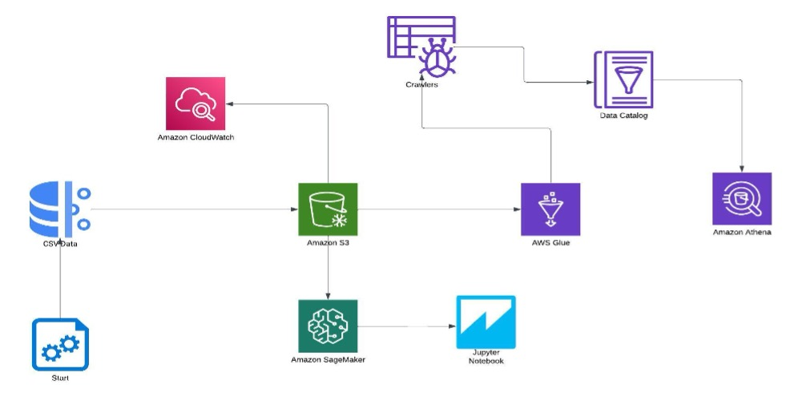

# Big-Data_CI-CD-Pipeline_AWS

## Demo
[Click to see the demonstration](https://www.youtube.com/watch?v=gmIltqSBG9g)

## Introduction
Using a real-time equities dataset, this project, named "Equity Insight Trends Explorer," seeks to examine the correlations and performance trends of several international stock exchanges. The project offers an extensive view of global financial markets by looking at several stock exchanges from various geographic locations and business sectors. A solid data pipeline based on AWS infrastructure underpins the study, guaranteeing effective data processing, storage, and continuous integration for managing huge datasets. With the use of cutting-edge AWS services like S3, Glue, CloudWatch, Lambda, Athena, and SageMaker to provide precise and fast analytics, the main objective is to get insights into market trends over time.

## Architecture

## Technology Used
- Programming Language: Python
- Amazon Web Services (AWS)

1. S3 (Simple Storage Service)
2. Glue
3. Data Catalog
4. Crawler
5. Athena
6. Lambda
7. CloudWatch
8. Sagemaker

## Note
Want to explore more about project, please refer to the proposal and summary report pdf files.

